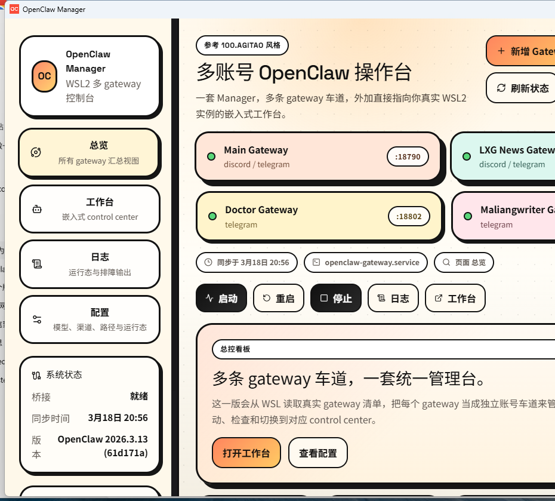
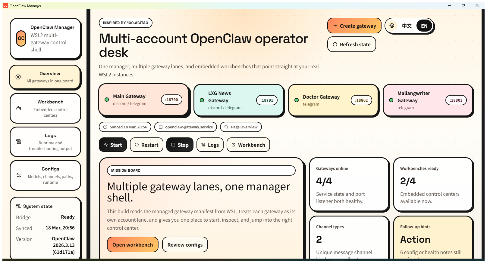
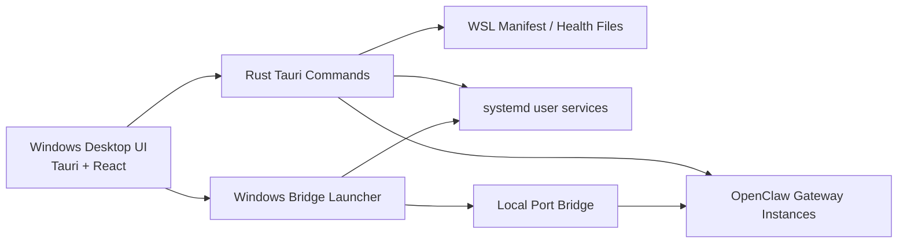

# Awesome OpenClaw Manager

[English](README.md) | [中文](README.zh-CN.md)

Awesome OpenClaw Manager is a Windows and WSL2 desktop control shell for OpenClaw multi-gateway setups. It is designed for teams or individuals who run multiple OpenClaw bots, multiple gateway lanes, multiple workbenches, and multiple Telegram or Discord channels, and want one clean operator desk to manage them all.


Keywords: OpenClaw Manager, OpenClaw multi gateway, OpenClaw Windows deployment, OpenClaw WSL2 deployment, Telegram bot dashboard, Discord gateway manager, OpenClaw Workbench, OpenClaw Control Center, Tauri, React, Rust.

[Releases](https://github.com/tbszz/awesome-openclaw-manager/releases) | [Chinese README](README.zh-CN.md) | [Release Guide](docs/releases/README.en.md) | [Windows Local Edition](https://github.com/tbszz/awesome-openclaw-manager/releases/tag/v0.0.7-windows-local) | [Windows + WSL2 Edition](https://github.com/tbszz/awesome-openclaw-manager/releases/tag/v0.0.7-windows-wsl2)

## Screenshots

### Chinese UI



### English UI



## What It Does

Awesome OpenClaw Manager gives you one desktop surface to:

- monitor multiple OpenClaw gateways
- start, stop, and restart gateway services
- inspect logs, config digests, and health signals
- jump into gateway-specific workbench and control center views
- create new gateway and bot lanes directly from the UI

This project is especially useful for:

- OpenClaw multi-bot management
- OpenClaw Telegram bot operations
- OpenClaw Discord gateway operations
- OpenClaw Windows desktop management
- OpenClaw Windows + WSL2 deployments

## Editions

| Edition | Best for | Includes | Docs |
| --- | --- | --- | --- |
| Windows Local Desktop | Users who already have a running OpenClaw environment and only want the Windows app | `openclaw-manager.exe`, `WebView2Loader.dll`, desktop README, screenshots | [Windows Local Guide](docs/releases/windows-local.en.md) |
| Windows + WSL2 Full Deployment | Users who want to run and manage multiple OpenClaw gateways inside Ubuntu on WSL2 | desktop app, WSL launcher, bridge scripts, gateway provisioning scripts, deployment docs | [Windows + WSL2 Guide](docs/releases/windows-wsl2.en.md) |

## Key Features

### Multi-gateway overview

- unified cards for every managed gateway
- gateway labels, ports, channel types, health, and workbench entry points
- live data sourced from the managed manifest instead of mock data

### Gateway lifecycle control

- one-click start
- one-click restart
- one-click stop
- service state and port listener checks

### Create gateway and bot from UI

- create a new gateway directly in the desktop app
- set gateway label, profile, port, and model config
- inherit environment variables from an existing gateway
- configure Telegram and Discord channels
- write the new `openclaw.json`, service unit, and manifest automatically

### Logs, configs, and workbench integration

- live gateway logs
- model, channel, path, and runtime summaries
- dedicated workbench and control center entry for each gateway

### Dynamic launcher wiring

- launcher reads the gateway manifest dynamically
- no more hard-coded port lists when a new gateway is added
- Windows-to-WSL bridge wiring expands with the manifest

### Reliability improvements

- BOM-tolerant JSON parsing for manifest and config files
- port allocation avoids WSL and Windows collisions
- new gateways are enabled and started automatically after creation

## Architecture



## Downloads

- [Download Windows Local Desktop Edition](https://github.com/tbszz/awesome-openclaw-manager/releases/tag/v0.0.7-windows-local)
- [Download Windows + WSL2 Full Deployment Edition](https://github.com/tbszz/awesome-openclaw-manager/releases/tag/v0.0.7-windows-wsl2)
- [Browse all releases](https://github.com/tbszz/awesome-openclaw-manager/releases)

## Quick Start

### Option 1: Windows Local Desktop

1. Download the `Windows Local` release package.
2. Extract it on Windows.
3. Run `openclaw-manager.exe`.
4. If you later need full WSL2 gateway orchestration, switch to the WSL2 edition.

### Option 2: Windows + WSL2 Full Deployment

1. Download the `Windows + WSL2` release package.
2. Prepare Windows 10/11, WSL2, Ubuntu, and a working OpenClaw environment.
3. Follow the guide in [docs/releases/windows-wsl2.en.md](docs/releases/windows-wsl2.en.md).
4. Launch `openclaw-manager-wsl-launch.ps1`.
5. Add new gateways and bots from the UI.

## Repository Layout

```text
.
|-- README.md
|-- README.zh-CN.md
|-- docs/
|   |-- releases/
|   |   |-- README.en.md
|   |   |-- README.md
|   |   |-- windows-local.en.md
|   |   |-- windows-local.md
|   |   |-- windows-wsl2.en.md
|   |   `-- windows-wsl2.md
|   `-- screenshots/
|       |-- manager-ui-en.png
|       `-- manager-ui.png
|-- openclaw-manager-wsl-launch.ps1
|-- scripts/
|   |-- build-manager-windows.ps1
|   |-- package-release-bundles.ps1
|   |-- provision_wsl_gateways.py
|   |-- start-wsl-proxy-bridge.ps1
|   |-- sync-openclaw-to-wsl.ps1
|   `-- windows-proxy-bridge.mjs
`-- openclaw-manager-src/
    `-- openclaw-manager-main/
```

## Local Development

```powershell
cd .\openclaw-manager-src\openclaw-manager-main
npm install
npm run dev
npm run tauri:dev
```

Build the Windows app:

```powershell
powershell -ExecutionPolicy Bypass -File .\scripts\build-manager-windows.ps1
```

Generate release bundles:

```powershell
powershell -ExecutionPolicy Bypass -File .\scripts\package-release-bundles.ps1
```

## Roadmap

- edit gateway in the UI
- delete gateway in the UI
- manage allowlists from the UI
- support more channel templates in the create flow
- keep improving SEO, docs, releases, and onboarding
