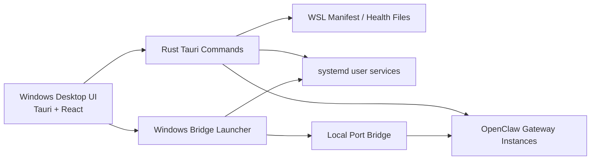

# Awesome OpenClaw Manager

> Awesome OpenClaw Manager 是面向 Windows 和 WSL2 的 OpenClaw 多 Gateway 管理器，适合 OpenClaw 多 bot、多账号、多工作台和多 gateway 的部署、运维与可视化控制场景。


关键词：OpenClaw Manager、OpenClaw 多 Gateway、Windows OpenClaw 部署、WSL2 OpenClaw 部署、Telegram Bot 管理面板、Discord Bot Gateway、OpenClaw Workbench、OpenClaw Control Center、Tauri、React、Rust。

[Releases 下载页](https://github.com/tbszz/awesome-openclaw-manager/releases) | [两个版本说明](docs/releases/README.md) | [Windows 本地桌面版](https://github.com/tbszz/awesome-openclaw-manager/releases/tag/v0.0.7-windows-local) | [Windows + WSL2 完整部署版](https://github.com/tbszz/awesome-openclaw-manager/releases/tag/v0.0.7-windows-wsl2)

## 项目截图


## 这是什么

Awesome OpenClaw Manager 是一个运行在 Windows 本机上的桌面控制台，用来统一管理 OpenClaw gateway、bot 通道、工作台入口、日志、服务状态和配置摘要。它重点解决的是 OpenClaw 在多 gateway、多 bot、多实例场景下缺少统一控制面板的问题。

当前项目尤其适合以下搜索和使用场景：

- OpenClaw 多 bot 管理面板
- OpenClaw 多账号 gateway 控制台
- Windows 上的 OpenClaw 管理器
- Windows + WSL2 的 OpenClaw 部署方案
- Telegram Bot / Discord Bot 的 OpenClaw 网关管理
- OpenClaw Control Center 的多实例入口整合

## 两个版本怎么选

| 版本 | 适合谁 | 包含内容 | 说明文档 |
| --- | --- | --- | --- |
| Windows 本地桌面版 | 已有 OpenClaw 运行环境，只想先在 Windows 本机安装桌面管理器的人 | `openclaw-manager.exe`、`WebView2Loader.dll`、本地版说明文档、截图 | [windows-local.md](docs/releases/windows-local.md) |
| Windows + WSL2 完整部署版 | 需要在 Windows + Ubuntu 子系统里管理多 gateway、多 bot、多 service 的人 | 桌面程序、WSL2 启动脚本、桥接脚本、gateway 配置脚本、完整部署说明 | [windows-wsl2.md](docs/releases/windows-wsl2.md) |

如果你要的是“在 Windows 上本地安装管理器程序”，选 `Windows 本地桌面版`。如果你要的是“在 Windows + WSL2 上完整管理 OpenClaw gateway、bot 和 service”，选 `Windows + WSL2 完整部署版`。

## 核心功能

### 1. OpenClaw 多 Gateway 总览

- 统一展示所有已纳管 gateway 的状态卡片
- 显示 gateway 标签、端口、消息通道、健康状态和工作台入口
- 支持快速切换不同 gateway
- 支持从真实运行中的 manifest 读取数据，而不是前端静态假数据

### 2. Gateway 生命周期管理

- 一键启动 gateway
- 一键重启 gateway
- 一键停止 gateway
- 查看 service 运行状态和监听端口状态
- 统一收口 gateway 的健康诊断信息

### 3. UI 直接新增 Gateway / Bot

- 在桌面 UI 中直接创建新的 gateway
- 支持填写 gateway 名称、profile、端口和模型配置
- 支持继承已有 gateway 的环境变量
- 支持 Telegram 和 Discord 通道配置
- 支持录入 bot token
- 支持自动写入新 gateway 的 `openclaw.json`
- 支持自动写入 service、manifest 和本地桥接配置

### 4. 日志、配置和 Workbench 集成

- 实时查看 gateway 日志
- 查看模型、通道、workspace、state dir 等配置摘要
- 为每个 gateway 提供独立的 Workbench / Control Center 入口
- 支持按 gateway 分配不同的本地 UI 端口

### 5. 动态扩展的启动器

- Windows 启动脚本会动态读取 gateway manifest
- 新增 gateway 后不需要再手工修改固定端口列表
- 桥接逻辑会按 manifest 自动扩展

### 6. 面向真实环境的稳定性增强

- 修复了 JSON 文件带 UTF-8 BOM 时的状态同步失败问题
- 端口分配会同时避开 WSL 与 Windows 本地冲突
- 新 gateway 创建后会自动启用并启动 service

## 当前架构



## 发布资源

当前仓库已经整理为两个可发布下载的版本：

- `Awesome-OpenClaw-Manager-Windows-Local-v0.0.7.zip`
- `Awesome-OpenClaw-Manager-Windows-WSL2-v0.0.7.zip`

下载方式：

- [下载 Windows 本地桌面版](https://github.com/tbszz/awesome-openclaw-manager/releases/tag/v0.0.7-windows-local)
- [下载 Windows + WSL2 完整部署版](https://github.com/tbszz/awesome-openclaw-manager/releases/tag/v0.0.7-windows-wsl2)
- [查看全部 Releases](https://github.com/tbszz/awesome-openclaw-manager/releases)

## 快速开始

### 方案一：Windows 本地桌面版

1. 从 [Releases](https://github.com/tbszz/awesome-openclaw-manager/releases) 下载 `Windows Local` 版本压缩包。
2. 解压后运行 `openclaw-manager.exe`。
3. 如果系统未安装 WebView2 运行时，请按 Windows 提示补齐。
4. 如果你后续需要 WSL2 gateway 自动启动、桥接和 service 管理，请改用 `Windows + WSL2 完整部署版`。

### 方案二：Windows + WSL2 完整部署版

1. 从 [Releases](https://github.com/tbszz/awesome-openclaw-manager/releases) 下载 `Windows WSL2` 版本压缩包。
2. 准备好 Windows 10/11、WSL2、Ubuntu 和可用的 OpenClaw 环境。
3. 按 [windows-wsl2.md](docs/releases/windows-wsl2.md) 完成脚本和运行环境准备。
4. 运行 `openclaw-manager-wsl-launch.ps1` 启动 manager、WSL service 和本地桥接。
5. 打开 UI 后直接新增 gateway / bot，后续扩容会更轻松。

## 目录结构

```text
.
|-- README.md
|-- docs/
|   |-- releases/
|   |   |-- README.md
|   |   |-- windows-local.md
|   |   `-- windows-wsl2.md
|   `-- screenshots/
|       `-- manager-ui.png
|-- openclaw-manager-wsl-launch.ps1
|-- scripts/
|   |-- build-manager-windows.ps1
|   |-- package-release-bundles.ps1
|   |-- provision_wsl_gateways.py
|   |-- start-wsl-proxy-bridge.ps1
|   |-- sync-openclaw-to-wsl.ps1
|   `-- windows-proxy-bridge.mjs
`-- openclaw-manager-src/
    `-- openclaw-manager-main/
```

## 常见问题

### OpenClaw Manager 支持多 Telegram bot 吗

支持。当前 UI 新建向导已经可以直接创建新的 gateway，并为 Telegram bot 写入通道配置和 bot token。

### OpenClaw Manager 支持多 Discord bot 或 Discord gateway 吗

支持。当前创建向导对 Discord 通道也有内置支持，适合 OpenClaw 的多通道 bot 场景。

### OpenClaw Manager 是否支持 Windows + WSL2

支持，这正是当前仓库最完整、最成熟的部署路线。Windows 负责桌面控制台和本地桥接，WSL2 负责 gateway 运行、service 和 manifest。

### Windows 本地桌面版和 Windows + WSL2 完整部署版有什么区别

本地桌面版更轻，重点是“在 Windows 本机安装桌面管理器程序”。WSL2 完整部署版更完整，重点是“在 Windows + Ubuntu 子系统里落地多 gateway、多 bot、多 service 管理能力”。

### 这个项目适合什么搜索关键词

如果你在找以下方向，这个仓库就是对口的：

- OpenClaw Windows 管理器
- OpenClaw WSL2 部署
- OpenClaw Telegram Bot Manager
- OpenClaw 多 Gateway 面板
- OpenClaw 多 bot 控制台

## 本地开发

进入源码目录：

```powershell
cd .\openclaw-manager-src\openclaw-manager-main
```

安装依赖：

```powershell
npm install
```

启动前端开发模式：

```powershell
npm run dev
```

启动 Tauri 开发模式：

```powershell
npm run tauri:dev
```

构建 Windows 程序：

```powershell
powershell -ExecutionPolicy Bypass -File .\scripts\build-manager-windows.ps1
```

生成两个发布包：

```powershell
powershell -ExecutionPolicy Bypass -File .\scripts\package-release-bundles.ps1
```

## 后续规划

- 支持在 UI 中编辑 gateway
- 支持在 UI 中删除 gateway
- 支持在 UI 中管理群白名单
- 支持更多消息通道的创建向导
- 持续优化对 OpenClaw Windows / WSL2 场景更友好的文档和发布节奏
