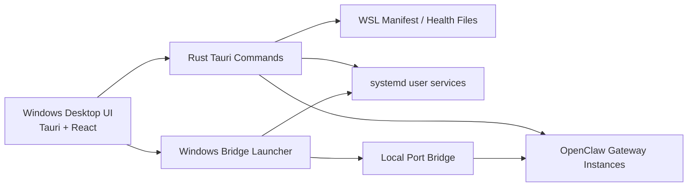

# OpenClaw Multi-Gateway Manager


面向 **OpenClaw 多网关场景** 的 Windows 桌面管理台。  
它把分散在 WSL2 中运行的多个 gateway 汇总到一个统一界面里，支持查看状态、启动/停止/重启、查看日志、打开工作台，以及直接在 UI 中创建新的 gateway / bot 车道。

## 截图


## 项目目标

这个项目主要解决两个实际问题：

1. 一台 Windows + WSL2 机器上同时运行多个 OpenClaw gateway 时，缺少统一的可视化操作界面。
2. 新增 bot / 新增 gateway 过去依赖手工改配置、手工加 systemd service、手工维护桥接端口，后续扩展成本高。

现在这套 manager 的目标是把这些动作收敛成一套可视化、多实例、可扩展的工作流。

## 核心功能

### 1. 多 Gateway 总览面板

- 统一展示所有已纳管 gateway 的状态卡片
- 显示 gateway 标签、端口、消息渠道、健康状态
- 支持快速切换查看不同 gateway
- 支持读取 WSL 中真实运行的 gateway 清单，而不是只展示前端假数据

### 2. Gateway 生命周期管理

- 一键启动 gateway
- 一键重启 gateway
- 一键停止 gateway
- 读取并展示 systemd service 运行状态
- 检查端口监听状态与桥接状态

### 3. Workbench / Control Center 集成

- 为每个 gateway 提供独立的 workbench 入口
- 支持按 gateway 启动对应的 Control Center runtime
- 支持基于不同 gateway 分配不同的本地 UI 端口
- 支持在 manager 中查看 workbench 的只读数据与运行状态

### 4. 日志与配置面板

- 实时查看 gateway 日志
- 查看服务、路径、模型、渠道、健康摘要
- 展示 gateway 对应的 profile、workspace、state dir 等关键信息
- 展示运行风险、配置备注和告警项

### 5. UI 直接新增 Gateway / Bot

这是当前版本最重要的一次升级。

现在可以在 manager 顶部直接点击“新增 Gateway”，通过弹窗向导完成以下操作：

- 填写 gateway 名称
- 指定 gateway id / profile / WSL 端口
- 选择继承哪条已有 gateway 的运行环境变量
- 设置主模型与回退模型
- 打开或关闭 memory search
- 配置消息渠道
  - 当前 UI 创建向导内置支持 `Telegram` 与 `Discord`
- 录入 bot token
- 配置 Telegram 私聊 / 群聊 / 流式输出策略

创建动作提交后，后端会自动完成：

- 创建新的 gateway state dir
- 初始化 workspace 脚手架
- 生成新的 `openclaw.json`
- 生成并写入 systemd user service
- 更新 WSL gateway manifest
- 更新本地健康状态文件
- 启用并启动新 service
- 将新端口加入 Windows <-> WSL 桥接

也就是说，后续新增 bot / 新增 gateway 不再需要人工逐项改配置。

### 6. 动态扩展启动器

Windows 启动脚本 [openclaw-manager-wsl-launch.ps1](openclaw-manager-wsl-launch.ps1) 已经从“硬编码 gateway 列表”的方式升级为：

- 优先读取 `\\wsl.localhost\\<distro>\\root\\.openclaw-manager\\gateways.json`
- 按 manifest 动态推导要启动的 service
- 按 manifest 动态推导要桥接的端口

这意味着：

- 以后 UI 新建出来的 gateway 会自动被 manager 启动器识别
- 不需要再手工修改脚本去追加新 service / 新端口

### 7. WSL 网关治理辅助脚本

仓库内附带了一批用于运维和构建的脚本：

- [build-manager-windows.ps1](scripts/build-manager-windows.ps1)
  - 用于在 Windows 上构建并部署 manager
- [provision_wsl_gateways.py](scripts/provision_wsl_gateways.py)
  - 用于初始化 / 管理 WSL 中的 gateway
- [sync-openclaw-to-wsl.ps1](scripts/sync-openclaw-to-wsl.ps1)
  - 用于同步 OpenClaw 配置到 WSL
- [start-wsl-proxy-bridge.ps1](scripts/start-wsl-proxy-bridge.ps1)
  - 启动 Windows 到 WSL 的本地桥接
- [windows-proxy-bridge.mjs](scripts/windows-proxy-bridge.mjs)
  - 端口代理桥接逻辑

## 当前架构



## 目录结构

```text
.
├─ README.md
├─ docs/
│  └─ screenshots/
│     └─ manager-ui.png
├─ openclaw-manager-wsl-launch.ps1
├─ scripts/
│  ├─ build-manager-windows.ps1
│  ├─ provision_wsl_gateways.py
│  ├─ start-openclaw-config-sync.ps1
│  ├─ start-wsl-proxy-bridge.ps1
│  ├─ stop-openclaw-config-sync.ps1
│  ├─ sync-openclaw-to-wsl.ps1
│  └─ windows-proxy-bridge.mjs
└─ openclaw-manager-src/
   └─ openclaw-manager-main/
      ├─ src/        # React 前端
      ├─ src-tauri/  # Rust / Tauri 后端
      ├─ package.json
      └─ README.md
```

## 运行要求

### 系统环境

- Windows 10 / 11
- WSL2
- Ubuntu（默认按 `Ubuntu` 发行版处理）
- 已安装并可运行的 OpenClaw gateway

### 开发环境

- Node.js
- npm
- Rust
- Tauri CLI

### Windows 构建说明

本项目已经验证过一条适合当前环境的 Windows 构建路径：

- 使用 `stable-x86_64-pc-windows-gnu`
- 使用 WinLibs / MinGW 工具链
- 在纯 ASCII 的临时目录中执行构建

[build-manager-windows.ps1](scripts/build-manager-windows.ps1) 已经把这套流程脚本化。

## 快速开始

### 1. 启动已部署的 manager

如果你已经在本机安装过 manager，直接运行：

```powershell
powershell -ExecutionPolicy Bypass -File .\openclaw-manager-wsl-launch.ps1
```

这个脚本会：

- 启动 WSL 中所需 gateway service
- 启动本地桥接
- 打开 Windows 侧 manager 程序

### 2. 在 UI 中创建新 Gateway

启动 manager 后：

1. 点击右上角“新增 Gateway”
2. 填写 gateway 名称与 bot 配置
3. 选择继承环境来源
4. 提交创建

创建完成后，新 gateway 会自动进入 manifest，并在下次启动时自动被识别。

### 3. 查看/控制现有 Gateway

你可以在 UI 中直接：

- 切换不同 gateway
- 启动 / 重启 / 停止
- 查看日志
- 打开 workbench
- 检查配置和运行状态

## 本地开发

进入 manager 源码目录：

```powershell
cd .\openclaw-manager-src\openclaw-manager-main
```

安装依赖：

```powershell
npm install
```

启动前端开发模式：

```powershell
npm run dev
```

启动 Tauri 开发模式：

```powershell
npm run tauri:dev
```

构建前端：

```powershell
npm run build
```

## 已完成的关键增强

当前公开版已经包含这些关键增强：

- 支持 UI 新增 gateway
- 支持动态 manifest 驱动的 launcher
- 支持多 gateway workbench 入口
- 支持 gateway 日志、配置、健康摘要
- 支持从 WSL 真实状态生成管理面板
- 修复了 JSON 文件带 UTF-8 BOM 时的解析失败问题

## 注意事项

- 当前“新建 gateway”向导重点覆盖 `Telegram` 和 `Discord` 两类 bot 配置。
- 如果某条渠道使用 `allowlist` 策略但白名单为空，群消息会被静默丢弃，这属于 OpenClaw 渠道安全策略本身，不是 manager bug。
- manager 依赖 WSL 中已有 OpenClaw 运行环境；它不是 OpenClaw 的一键安装器，而是面向“已部署环境”的可视化控制台。

## 仓库说明

这个仓库聚焦于 **多 gateway manager 本身**，因此以下内容默认不纳入版本控制：

- 本地运行时状态
- 编译产物
- `node_modules`
- `target`
- 与本仓库无关的临时控制中心副本

## 后续规划

- 在 UI 中支持编辑 gateway
- 在 UI 中支持删除 gateway
- 在 UI 中支持群白名单管理
- 在 UI 中支持更多渠道类型的创建向导
- 继续完善 README、打包流程和自动化发布
