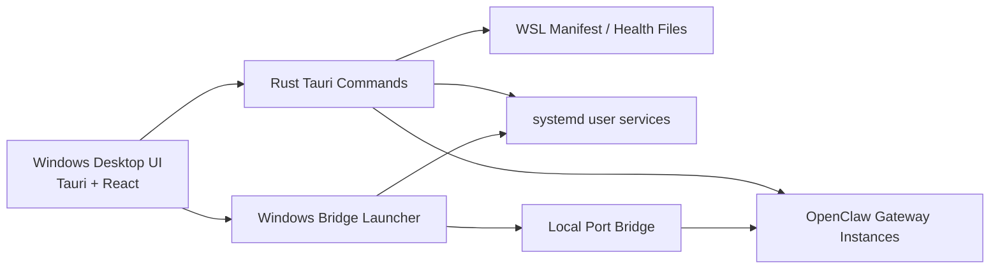

# Awesome OpenClaw Manager

[English](README.md) | [中文](README.zh-CN.md)

Awesome OpenClaw Manager 是一个面向 Windows 和 WSL2 的 OpenClaw 多 Gateway 桌面控制台，适合多 bot、多账号、多工作台、多 Telegram/Discord 通道的 OpenClaw 部署、运维与统一管理场景。


关键词：OpenClaw Manager、OpenClaw 多 Gateway、OpenClaw Windows 部署、OpenClaw WSL2 部署、Telegram Bot 管理面板、Discord Gateway 管理、OpenClaw Workbench、OpenClaw Control Center、Tauri、React、Rust。

[Releases 下载页](https://github.com/tbszz/awesome-openclaw-manager/releases) | [English README](README.md) | [版本说明](docs/releases/README.md) | [Windows 本地桌面版](https://github.com/tbszz/awesome-openclaw-manager/releases/tag/v0.0.7-windows-local) | [Windows + WSL2 完整部署版](https://github.com/tbszz/awesome-openclaw-manager/releases/tag/v0.0.7-windows-wsl2)

## 项目截图

### 中文界面


### 英文界面


## 这是做什么的

Awesome OpenClaw Manager 提供一个统一的桌面操作台，用来：

- 查看多个 OpenClaw gateway 的状态
- 启动、停止、重启 gateway 服务
- 查看日志、配置摘要和健康信息
- 进入各 gateway 对应的 workbench 与 control center
- 直接在 UI 中新增 gateway 和 bot

这个项目特别适合以下搜索和使用场景：

- OpenClaw 多 bot 管理
- OpenClaw Telegram Bot 运维
- OpenClaw Discord Gateway 管理
- OpenClaw Windows 桌面控制台
- OpenClaw Windows + WSL2 部署方案

## 两个版本怎么选

| 版本 | 适合谁 | 包含内容 | 文档 |
| --- | --- | --- | --- |
| Windows 本地桌面版 | 已经有 OpenClaw 运行环境，只需要 Windows 桌面程序的人 | `openclaw-manager.exe`、`WebView2Loader.dll`、桌面版说明、截图 | [本地桌面版说明](docs/releases/windows-local.md) |
| Windows + WSL2 完整部署版 | 需要在 Ubuntu 子系统中运行和管理多个 OpenClaw gateway 的人 | 桌面程序、WSL 启动器、桥接脚本、gateway 初始化脚本、完整部署文档 | [完整部署版说明](docs/releases/windows-wsl2.md) |

## 核心功能

### 多 Gateway 总览

- 统一展示所有纳管 gateway 的状态卡片
- 显示 gateway 标签、端口、通道类型、健康状态和工作台入口
- 从真实 manifest 读取运行状态，而不是静态假数据

### Gateway 生命周期控制

- 一键启动
- 一键重启
- 一键停止
- 查看服务状态和端口监听状态

### 在 UI 中直接创建 Gateway / Bot

- 直接创建新的 gateway
- 填写 gateway 名称、profile、端口和模型配置
- 继承已有 gateway 的环境变量
- 配置 Telegram 和 Discord 通道
- 自动写入新的 `openclaw.json`、service 和 manifest

### 日志、配置与 Workbench 集成

- 实时查看 gateway 日志
- 查看模型、通道、路径和运行摘要
- 每个 gateway 都有独立的 workbench / control center 入口

### 动态启动器

- 启动器动态读取 gateway manifest
- 新增 gateway 后不再需要手工维护固定端口列表
- Windows 到 WSL 的桥接会随 manifest 自动扩展

### 稳定性增强

- 修复 manifest 和配置文件带 UTF-8 BOM 时的解析问题
- 端口分配会同时避开 WSL 和 Windows 本地冲突
- 新 gateway 创建后自动启用并启动服务

## 架构



## 下载

- [下载 Windows 本地桌面版](https://github.com/tbszz/awesome-openclaw-manager/releases/tag/v0.0.7-windows-local)
- [下载 Windows + WSL2 完整部署版](https://github.com/tbszz/awesome-openclaw-manager/releases/tag/v0.0.7-windows-wsl2)
- [查看全部 Releases](https://github.com/tbszz/awesome-openclaw-manager/releases)

## 快速开始

### 方案一：Windows 本地桌面版

1. 下载 `Windows Local` 发布包。
2. 在 Windows 中解压。
3. 运行 `openclaw-manager.exe`。
4. 如果后续需要完整的 WSL2 gateway 编排能力，再切换到 WSL2 版本。

### 方案二：Windows + WSL2 完整部署版

1. 下载 `Windows + WSL2` 发布包。
2. 准备好 Windows 10/11、WSL2、Ubuntu 和可用的 OpenClaw 环境。
3. 参考 [docs/releases/windows-wsl2.md](docs/releases/windows-wsl2.md)。
4. 运行 `openclaw-manager-wsl-launch.ps1`。
5. 在 UI 中继续新增 gateway 和 bot。

## 仓库结构

```text
.
|-- README.md
|-- README.zh-CN.md
|-- docs/
|   |-- releases/
|   |   |-- README.en.md
|   |   |-- README.md
|   |   |-- windows-local.en.md
|   |   |-- windows-local.md
|   |   |-- windows-wsl2.en.md
|   |   `-- windows-wsl2.md
|   `-- screenshots/
|       |-- manager-ui-en.png
|       `-- manager-ui.png
|-- openclaw-manager-wsl-launch.ps1
|-- scripts/
|   |-- build-manager-windows.ps1
|   |-- package-release-bundles.ps1
|   |-- provision_wsl_gateways.py
|   |-- start-wsl-proxy-bridge.ps1
|   |-- sync-openclaw-to-wsl.ps1
|   `-- windows-proxy-bridge.mjs
`-- openclaw-manager-src/
    `-- openclaw-manager-main/
```

## 本地开发

```powershell
cd .\openclaw-manager-src\openclaw-manager-main
npm install
npm run dev
npm run tauri:dev
```

构建 Windows 程序：

```powershell
powershell -ExecutionPolicy Bypass -File .\scripts\build-manager-windows.ps1
```

生成发布包：

```powershell
powershell -ExecutionPolicy Bypass -File .\scripts\package-release-bundles.ps1
```

## 后续规划

- 在 UI 中编辑 gateway
- 在 UI 中删除 gateway
- 在 UI 中管理 allowlist
- 支持更多消息通道模板
- 持续优化文档、发布与 SEO
